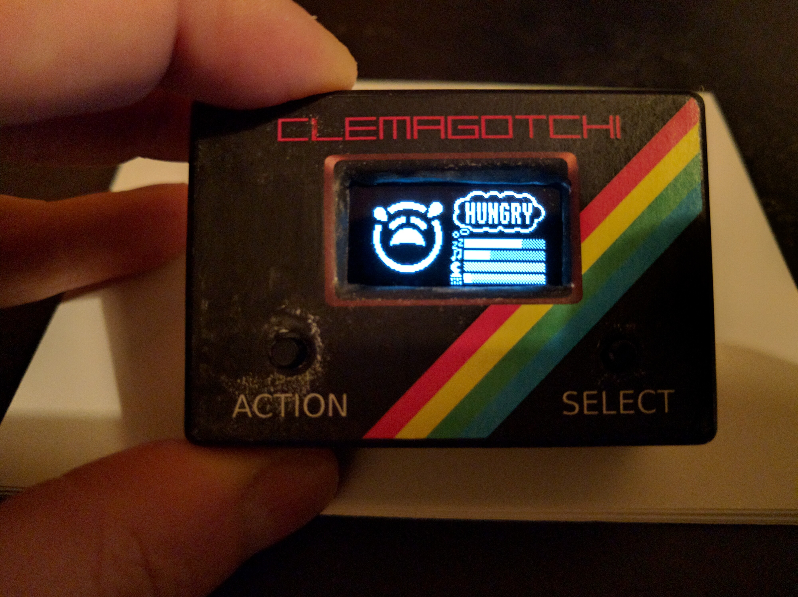
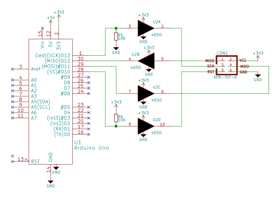
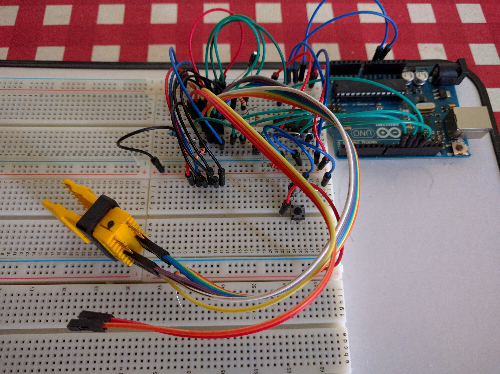
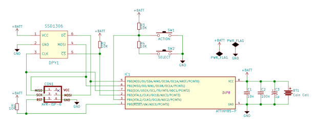

# Introduction

My girlfriend, Clem, and I have a running joke that when she comes home from
work she's akin to a [tamagotchi](https://en.wikipedia.org/wiki/Tamagotchi);
she needs feeding, bathing and entertaining and then she's happy. For
Valentine's Day 2016 I decided I wanted to make a real-life tamagotchi version
of her as a present.  This page documents the design process and the final
result.

# Context

At time of writing, I've been learning electronics for just over a year. I
wanted to make something which showed off what I've learned and give my
girlfriend something which was unique. I work as a research scientist by day
which usually involves writing software. While [waiting for code to
compile](https://xkcd.com/303/), I like to browse discount electronics
components and modules on eBay.

# Concept <small>(T minus 9 days)</small>

About a week before "V-day" I was browsing eBay and came across some little
[OLED display
modules](http://www.ebay.co.uk/itm/White-0-96-inch-SPI-Serial-Port-128-64-OLED-LCD-LCM-Display-Module-for-Arduino-/361455123355?hash=item5428677b9b:g:g-QAAOSw5VFWL0Gp).
They looked fun to play with and the concept of building a real-life
"Clemagotchi" started to form in my head. I found a UK seller for the modules,
placed an order and then started thinking about how I might actually implement
the thing with the parts I either had lying around or that I could buy at short
notice.

I did a couple of back-of-the-envelope calculations about the maximum size the
hardware would take up if I ended up with the worst-case scenario of having to
use a full-sized Arduino nano and fairly beefy LiPo cell to power the device. I
then bought a little ABS project box which would just fit the hardware in.

I hoped that there would in fact be plenty of space in the box. In the end, my
worst-case planning was indeed overly pessimistic but I wanted to make sure I
wouldn't have to buy a bigger box.

# Planning <small>(T minus 8 days)</small>

Fortunately my girlfriend was away for the day the Saturday before "V-day". I
spent the day researching the project. I found that Adafruit had an Arduino
[library](https://github.com/adafruit/Adafruit_SSD1306) for the display. I
happened to have a stock of ATTiny85 microcontrollers and there's a
[port](http://highlowtech.org/?p=1695) of the Arduino IDE to that controller.

"Excellent," I thought, "I can write the firmware for the ATTiny85 and make use
of the display library." This turned out to be false but I didn't know it then.

## The tamagotchi logic

I knocked up a quick [Javascript prototype](js-prototype) of the actual
tamagotchi logic to make sure I knew what I wanted the firmware to do. It's a
lot quicker to prototype in Javascript before writing the firmware in C.

## Roughing out the displays

I could also prototype out the screens. I made a few monochrome icons for the
display and wrote some Python scripts to start roughing out the screens. At this
point I found a post indicating that the Adafruit graphics library wouldn't work
on the ATTiny85. This was entirely due to space constraints: the ATTiny85 has
around 16-tweets of non-volatile storage for program code and graphics.

The SSD1306 screen works by, essentially, specifying rectangular area of the
screen to update and then sending data which fills that area. I wrote a Python
script with some functions for blit-ing data in this manner to a PNG and
prototyped the screens.

## Programming the ATTiny85 and not blowing up the display

I wanted to be able to program the
controlling ATTiny85 in place which meant making an
[ISP header](https://en.wikipedia.org/wiki/Atmel_AVR#ISP) for the circuit. (I
ended up using a clip directly on the ATTiny85 rather than a separate header but
the principle is the same.)

While I was waiting for the display to come, I played with programming the
ATTiny85 microcontroller. Conveniently, an Arduino Uno [can be
programmed](http://highlowtech.org/?p=1706) to act as an ISP programmer.

This was working well but, reading the datasheet on the SSD1306 display, it was
clear that I had to spend a little time worrying about voltages.  I couldn't put
5V logic levels on the display without running the risk of frying the
electronics. I had to make sure that the Clemagotchi was exposed to no more than
3.3V. Fortunately, all of the signals on the ISP header are unidirectional and
so a [74HC4050](http://www.nxp.com/documents/data_sheet/74HC4050.pdf) could be
used to convert the 5V Arduino Uno into a 3.3V ISP.

For those following along at home, here's the schematic:

Technically only the output lines (MOSI, SCK and RST)
needed to be level-shifted. The MISO line, although running at 3.3V, would still
be OK driving the Arduino Uno. To guard against accidents I used the '4050 as a
buffer on the MISO line so that the Clemagotchi wouldn't be fried even if the
Arduino Uno accidentally drove the MISO line.

The pull-down on the SCK line is to make sure that the line has a defined value
as the Arduino boots and, similarly, the pull-up on RST
is there to prevent accidental resets. These were probably overkill but it
seemed sensible to include them.

Since this was going to be a temporary use bit of hardware, I wired it up on my
Arduino prototyping breadboard which is made from a Poundland whiteboard. Here's
a picture:

The yellow clip which was used to attach directly to the ATTiny85 is clearly
visible. Notice that there's no power wire coming from the Arduino. That's
intentional. I wanted to power the Clemagotchi off battery lest my tired brain
accidentally connected to the 5V Arduino power.

If I were being even more careful, I'd have added a tri-state buffer to cause
the ISP pins to be electrically disconnected when the programmer wasn't running.
For my needs I got away with it but if I ever make a variable-voltage ISP
shield for the Arduino, I'll add one.

# Building <small>(T minus 5 days)</small>

I live with my girlfriend and so I had to take opportunities where I get them.
Five days before "V-day", she went to be early. This was my opportunity. The
screen hard arrived and so I experimented with driving the display from my
Arduino Uno via a 74HC4050 for level-conversion.

I knew that memory was going to be tight for the display so I wrote a Python
script to perform a simple run-length encoding of the images and save them
directly as a C++ header suitable for inclusion into the firmware. By around
this point, I had display updates working quite nicely.

<iframe width="560" height="315" src="https://www.youtube.com/embed/AmO9o_UYeFY"
frameborder="0" allowfullscreen></iframe>

This was using the hardware SPI support on the Arduino Uno. The ATTiny85 doesn't
have hardware SPI but the [USI
hardware](http://www.atmel.com/images/doc2582.pdf) on the ATTiny85 could be bent
to my will via the [TinySPI](https://github.com/JChristensen/tinySPI).

The ATTiny85 has five easily accessible GPIO pins. The display needed four of
them so I had one left for two buttons. Oh dear :(. After a little head
scratching I came up with the (non-original) idea of wiring the two switches to
form a switchable voltage divider. The GPI pin thereby gets VCC, half-VCC or 0V
depending on whether no buttons are pressed, the "select" button is pressed or
the "action" button is pressed. This design precludes pressing both buttons at
once but I had no need of that in the UI.

Here's the full Clemagotchi schematic I came up with:

The pull-up on CS is there to make sure the display
is inactive when programming the ATTiny85. The pull-up on RST is to protect against spurious resets. In the final
hardware module I also added a little reset switch which simply pulled RST low but this was probably unnecessary.

# Packaging <small>(T minus 4 days)</small>

At this point, I had a working Clemagotchi module but no nice case:

<iframe width="560" height="315" src="https://www.youtube.com/embed/xY1wfzIo8cQ"
frameborder="0" allowfullscreen></iframe>

I made the executive decision that I didn't have enough time to learn enough CAD
to 3D print a funky enclosure at work. Instead I very, very quietly marked up
and drilled a black ABS project box for the Clemagotchi. I used some small files
to nicely bezel the front window and I test-fit the module.

The next morning at work I "borrowed" the colour laser printer to print a nice
decal on a sheet of adhesive labels. The decal was designed to be forgiving in
alignment and, hopefully, to evoke a nice "retro" gaming æsthetic.

# Refining <small>(T minus 3, 2, 1&hellip;)</small>

# Giving <small>(Lift-off!)</small>

